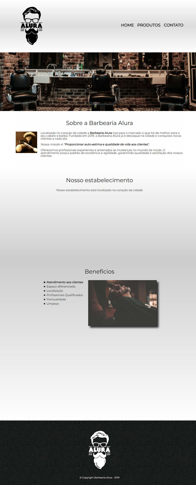
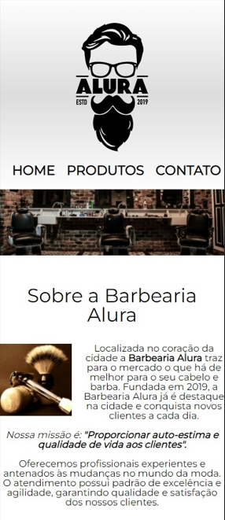

<h1 align="center">
   💈 | Barbearia Alura
</h1>

<h4 align="center">
  Barbearia Alura feita nas primeiras aulas de HTML e CSS da  Alura.
</h4>

---

<h3>VERSÃO WEB</h3>

<h3>VERSÃO MOBILE</h3>

<table align="center">
  <tr>
    <td align="center">
      <a href="https://github.com/laisfrr">
         
      </a>
    </td>
  </tr>
</table>

---

## ✅ O site é composto por :

-   **Home:** Onde temos a apresentação da barbearia e falando dos benefícios.
-   **Produtos:** Nessa seção temos os serviços que são feitos pela barbearia;
-   **Contato:** Na parte de contato temos um formulário para contatos gerais e também agendamento de atendimento;

---

## ⚙ Tecnologias utilizadas

-   HTML;
-   CSS;
- *Javascript ("em breve, com validação de formulário")*
---

## ⚠ Dificuldades durante o projeto

-   Aplicar responsividade
-   Alinhas elementos com CSS

---

## 👩 Autor(a) 

<table align="center">
  <tr>
    <td align="center">
      <a href="https://github.com/laisfrr" target="_blank">
         
        
          <b>Laís Oliveira</b>
        
      </a>
    </td>
  </tr>
</table>

<table align="center">
    <td align="center">
      <a href="https://www.linkedin.com/in/laisfrr/" target="_blank">
         
      </a>
</table>

